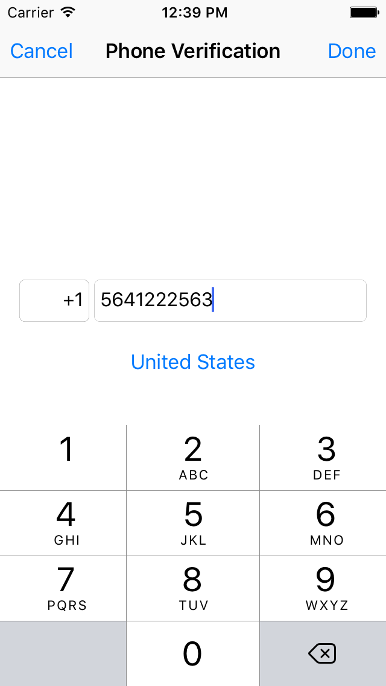
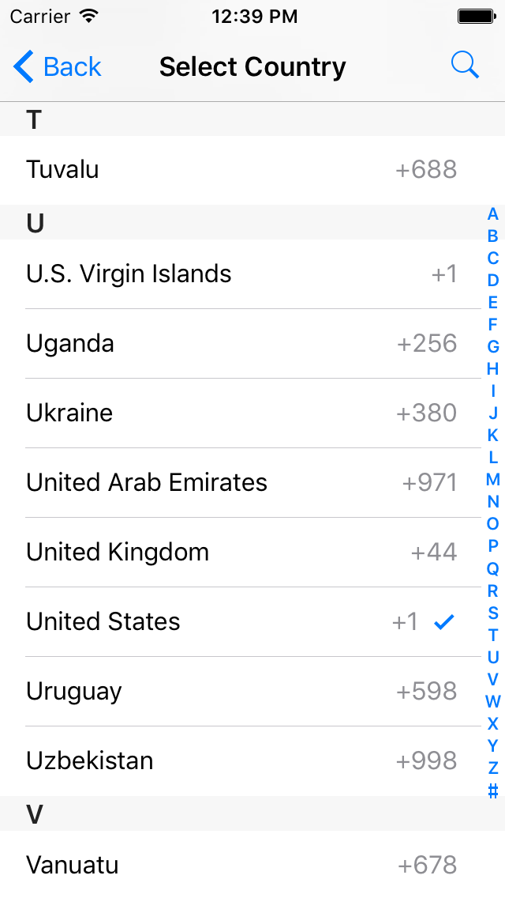

# PhoneNumberPicker
A simple and easy to use view controller enabling you to enter a phone number with a country code similar to WhatsApp

Screenshots
--------------


Installation
--------------
Drag and drop the *src* folder to your project

Setup
--------------
``` swift
// 1. Add the protocol PhoneNumberViewControllerDelegate
class ViewController: UIViewController,PhoneNumberViewControllerDelegate {


    //present
    func present(){
        
        //create the controller
        let phoneNumberViewController = PhoneNumberViewController.standardController()
        
        //set the delegate
        phoneNumberViewController.delegate = self
        
        //push
        navigationController?.pushViewController(phoneNumberViewController, animated: true)
    }

    //Delegate Methods
    func phoneNumberViewControllerDidCancel(_ phoneNumberViewController: PhoneNumberViewController) {
        self.navigationController?.popViewController(animated: true)
        print("canceled")
    }

    func phoneNumberViewController(_ phoneNumberViewController: PhoneNumberViewController, didEnterPhoneNumber phoneNumber: String) {
        self.navigationController?.popViewController(animated: true)
        print("phone number: \(phoneNumber)")
    }

}
```

